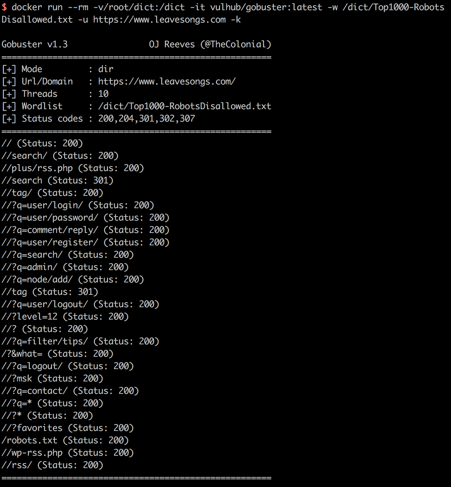
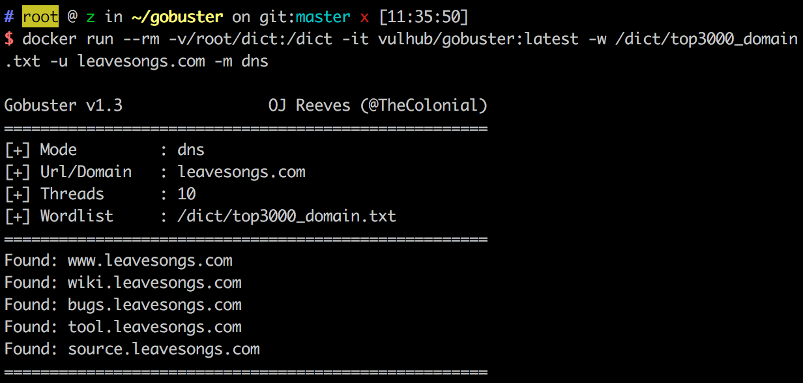

# gobuster - Directory/file & DNS busting tool written in Go

Repository site: https://github.com/OJ/gobuster

## Usage

DNS Mod:

```
docker run --rm -v/root/dict:/dict -it vulhub/gobuster:latest -w /dict/top3000_domain.txt -u example.com -m dns
```

Dir Mod:

```
docker run --rm -v/root/dict:/dict -it vulhub/gobuster:latest -w /dict/Top1000-RobotsDisallowed.txt -u https://www.leavesongs.com -k
```

## Build

You can build it yourself:

```
docker build -t your_image_name .
```

## Screenshot



